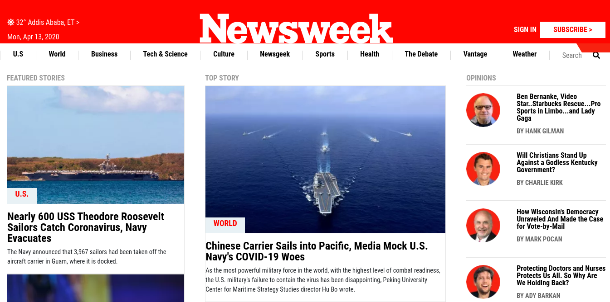

# [https://thenextweb.com/](http://archive.vn/JVxnj) responsive page clone using bootstrap

Clone of [https://newsweek.com/ home page](http://archive.vn/JVxnj) for my seventh Microverse project included in the HTML & CSS course. in this project i have clone the website with all it's responsive features to support mobile, tablet and desktop view using bootstrap. in order to achive responsiveness i have bootstrap CSS library & few CSS media queries.

## Built With

- HTML
- CSS
- Bootstrap

## Live Demo

[Live Demo Link](https://rawcdn.githack.com/Mikearaya/newsweek-clone/0f302cc280198edbfb5d05f8c99ffebe0ae6c936/index.html)

## Getting Started

To get a local copy up and running follow these simple example steps.

- Clone or download this repository to your local workstation.

### Prerequisites

there are no prerequisits to run the project. but if you want to work on it make sure you have the following installed in your global evnviroment

- [npm](https://www.npmjs.com/products/teams?utm_source=adwords&utm_medium=ppc&utm_campaign=npmTeams2019Q2&utm_content=site&gclid=Cj0KCQjwyPbzBRDsARIsAFh15JaJyPdeb-Q11Rq-LMaulSWINd6PYdJQ2OkZyE75reyBcpnnmwPrgRoaAv_5EALw_wcB)
- [npx](https://www.npmjs.com/package/npx)

### Install

for development make sure you run the following command before you start working on the project
`npm install`
this will install all the packages used for development purpose, mainly `stylint`, `preetier`, `html-validator`, `husky`, &`lint-staged` that will be used for development purpose.

### Usage

enter the directory where you cloned or downloaded the project and open index.html file using your favorite browser

## Authors

👤 **Mikael Araya**

- Github: [@mikearaya](https://github.com/mikearaya)
- Twitter: [@mikearaya12](https://twitter.com/mikearaya12)
- Linkedin: [linkedin](https://linkedin.com/in/mikael-araya)

## 🤝 Contributing

Contributions, issues and feature requests are welcome!

Feel free to check the [issues page](issues/).

## Show your support

Give a ⭐️ if you like this project!

## 📝 License

This project is [MIT](lic.url) licensed.
